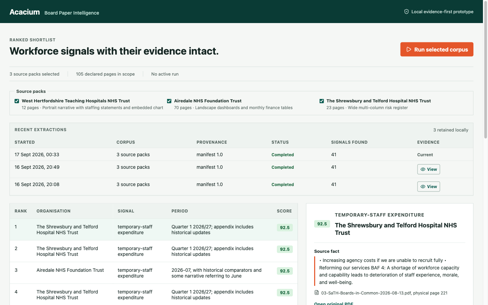
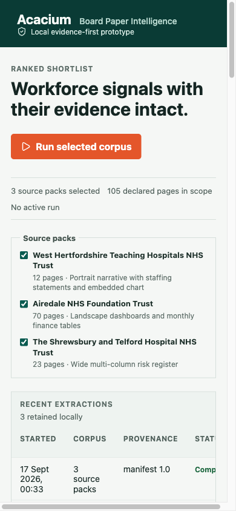

# Acacium Board Paper Intelligence

A locally runnable, evidence-first interview prototype. It extracts cautious workforce signals
from a small, declared corpus of public NHS board papers, ranks them, and keeps the original source
PDF, physical page, excerpt, score rationale and reviewer decision attached to every candidate.

It is a prioritisation aid. It is not evidence of a tender, purchasing decision, current commercial
eligibility or a recommendation to contact an organisation.

## Reproduce From A Fresh Mac

### 1. Install prerequisites

Use Python 3.13, Node.js 22 or later, `uv`, `just`, Git and Conda. On macOS with Homebrew:

```sh
brew install node uv just
conda create -n acacium python=3.13 -y
```

### 2. Clone and prepare the project

```sh
git clone https://github.com/danielbell99/Acacium.git
cd Acacium
conda activate acacium
just bootstrap
just fetch-documents
```

`just fetch-documents` downloads the exact public files declared in the source manifest and rejects
any file whose SHA-256 digest does not match. It is safe to run again: already verified local copies
are reused. Use `uv run python scripts/fetch_documents.py --force` only when deliberately fetching
fresh copies for comparison.

### 3. Run the prototype

```sh
just dev
```

Open http://localhost:5173. The React client proxies API calls to FastAPI on loopback port `8000`.
Use `just down-all` to stop both services.

The readiness probe at http://127.0.0.1:8000/api/health/ready must return `{"status":"ready"}`
before an extraction is considered valid.

## What It Does

- Downloads three declared public board papers, verifies each SHA-256 digest, and processes only
  the 105 pages tracked in `config/source-manifest.json`.
- Extracts deterministic, evidence-linked workforce candidates using versioned service-fit and
  scoring configurations.
- Ranks the strongest 20 candidates, links each one to the original local PDF page, and preserves
  run provenance, reviewer rationale and approved CSV exports.
- Lets a reviewer select source packs, inspect previous retained runs and reopen a historic
  evidence snapshot without changing it.

## What It Does Not Cover

The [Azure architecture diagram](docs/architecture/acacium-azure-solution-architecture.drawio)
shows the intended production destination, not services provisioned by this prototype. The local
application does **not** currently provide:

- Azure hosting, App Gateway/WAF, private networking, Key Vault, managed identities or enterprise
  authentication and authorisation.
- Azure Blob Storage, Azure SQL, Azure Monitor/Application Insights, Durable Task orchestration or
  scheduled processing.
- Azure AI Document Intelligence OCR/layout extraction or Microsoft Foundry model inference. The
  prototype uses a deterministic local PDF parser and deliberately contains no cloud credentials.
- Procurement intelligence, autonomous outreach, automated business decisions, or a guarantee that
  a board-paper statement is current.

The explicit local-to-Azure replacement map is in
[docs/architecture/README.md](docs/architecture/README.md).

## Run Tests And Quality Checks

```sh
# Python unit tests and frontend unit tests
make test

# FastAPI integration tests
make test-integration

# Formatting, linting, static types, tests, dependency audit and dead-code check
make qa

# Required dependency and hook setup check
just bootstrap

# Production frontend build
cd frontend && npm run build
```

`make qa` runs Ruff, mypy, ESLint, TypeScript, 24 Python unit tests, 3 frontend tests, 8 FastAPI
integration tests, `pip-audit`, and Vulture. The saved test corpus validates source integrity,
extraction rules, scoring bands, review persistence, run recovery, API contracts and the frontend
API client.

## Screenshots

Desktop: source selection, retained-run provenance, ranked shortlist and page-level evidence.



Mobile: the same source-selection workflow on a narrow viewport. Wide data tables intentionally
scroll horizontally rather than truncating evidence.



## Repository Layout

- `backend/`: FastAPI API, deterministic extraction, integrity validation and SQLite persistence.
- `frontend/`: React/TypeScript reviewer interface.
- `config/`: public source manifest, service catalogue and scoring rubric.
- `docs/architecture/`: editable Draw.io Azure production design and local-to-Azure mapping.
- `docs/screenshots/`: checked-in browser evidence used in this README.
- `scripts/fetch_documents.py`: reproducible, hash-verified public corpus acquisition.
